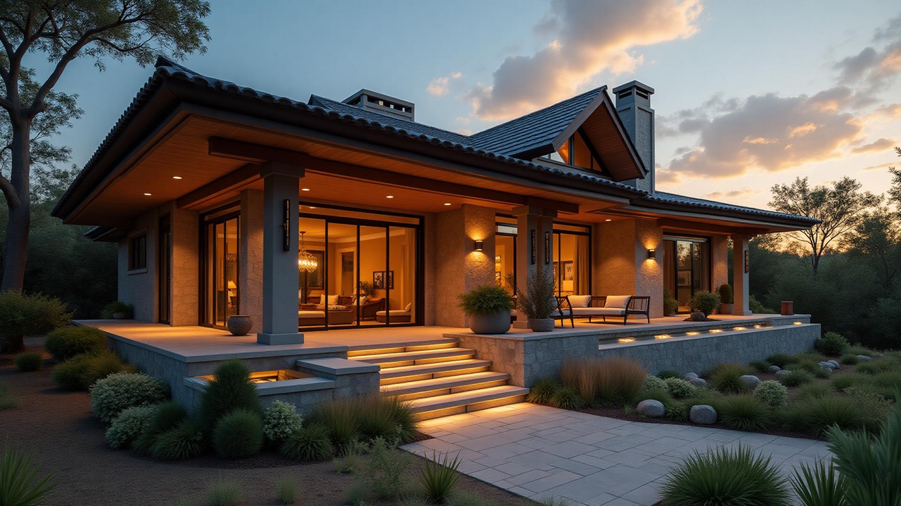

# Serenity Lodge Bulawayo

A luxury hotel website showcasing elegant accommodations and premium hospitality services in Zimbabwe. Built with modern web technologies to provide an immersive and sophisticated user experience.



## 🌟 Features

### Design & User Experience
- **Responsive Design**: Fully responsive layout optimized for desktop, tablet, and mobile
- **Luxury Aesthetics**: Sophisticated color palette with warm earth tones and elegant typography
- **Smooth Animations**: Custom CSS animations including camera panning effects and smooth transitions
- **Interactive Navigation**: Dynamic navigation bar with scroll-based styling changes
- **Professional Typography**: Custom font pairing with Playfair Display serif and Inter sans-serif

### Sections & Functionality
- **Hero Section**: Immersive full-screen hero with animated background panning effect
- **About Section**: Compelling story about the lodge's luxury and heritage
- **Rooms Gallery**: Showcase of premium accommodations with detailed descriptions
- **Amenities**: Highlight of luxury services and facilities
- **Contact Section**: Interactive contact form with direct phone and email integration
- **Smooth Scrolling**: Navigation links with smooth scroll-to-section functionality

### Technical Features
- **Performance Optimized**: Fast loading with optimized images and efficient code
- **SEO Ready**: Semantic HTML structure with proper meta tags and accessibility
- **Modern Architecture**: Component-based React structure for maintainability
- **Type Safety**: Full TypeScript implementation for robust development

## 🛠️ Technologies Used

- **Frontend Framework**: React 18
- **Build Tool**: Vite
- **Language**: TypeScript
- **Styling**: Tailwind CSS with custom design system
- **UI Components**: shadcn/ui component library
- **Icons**: Lucide React
- **Animation**: Custom CSS keyframes and Tailwind animations
- **Fonts**: Google Fonts (Playfair Display, Inter)

## 🚀 Getting Started

### Prerequisites
- Node.js (v16 or higher)
- npm or yarn package manager

### Installation

1. **Clone the repository**
   ```bash
   git clone <YOUR_GIT_URL>
   cd serenity-lodge
   ```

2. **Install dependencies**
   ```bash
   npm install
   ```

3. **Start development server**
   ```bash
   npm run dev
   ```

4. **Open in browser**
   Navigate to `http://localhost:5173` to view the application

### Build for Production

```bash
npm run build
```

The built files will be in the `dist` directory.

## 📁 Project Structure

```
src/
├── components/           # React components
│   ├── ui/              # shadcn/ui components
│   ├── Hero.tsx         # Hero section with animated background
│   ├── Navigation.tsx   # Responsive navigation bar
│   ├── About.tsx        # About section
│   ├── Rooms.tsx        # Rooms showcase
│   ├── Amenities.tsx    # Amenities section
│   ├── Contact.tsx      # Contact form and information
│   └── Footer.tsx       # Site footer
├── assets/              # Images and static assets
├── pages/               # Page components
├── hooks/               # Custom React hooks
├── lib/                 # Utility functions
├── index.css           # Global styles and design tokens
└── main.tsx            # Application entry point
```

## 🎨 Design System

### Color Palette
- **Primary Colors**: Luxury bronze, gold, cream, and sand tones
- **Background**: Warm neutrals with elegant gradients
- **Text**: High contrast combinations for excellent readability

### Typography
- **Headlines**: Playfair Display (serif) - elegant and sophisticated
- **Body Text**: Inter (sans-serif) - clean and readable
- **Responsive**: Fluid typography scaling across devices

### Animations
- **Camera Panning**: Smooth left-to-right background movement
- **Fade Transitions**: Elegant content reveals on scroll
- **Hover Effects**: Subtle interactions for enhanced UX
- **Smooth Scrolling**: Navigation with easing transitions

## 🎯 Key Components

### Hero Section
- Full-screen immersive design
- Animated background with camera panning effect
- Call-to-action buttons with smooth scroll navigation
- Scroll indicator with floating animation

### Navigation
- Fixed header with scroll-based transparency
- Mobile-responsive hamburger menu
- Smooth scroll navigation to sections
- Dynamic styling based on scroll position

### Rooms Gallery
- High-quality imagery showcase
- Detailed descriptions and pricing
- Interactive booking buttons
- Responsive card layout

### Contact Integration
- Direct phone dialer integration (`tel:` links)
- Email client integration with pre-filled subjects
- Responsive contact form
- Location and contact information display

## 📱 Responsive Design

The website is fully responsive with breakpoints optimized for:
- **Mobile**: 320px - 768px
- **Tablet**: 768px - 1024px
- **Desktop**: 1024px and above
- **Large Screens**: 1400px and above

## 🔧 Customization

### Colors
Modify the color scheme in `tailwind.config.ts` and `src/index.css`:

```css
:root {
  --luxury-bronze: [hsl values];
  --luxury-gold: [hsl values];
  --luxury-cream: [hsl values];
  --luxury-sand: [hsl values];
}
```

### Animations
Add custom animations in `tailwind.config.ts`:

```javascript
keyframes: {
  "custom-animation": {
    "0%": { /* start state */ },
    "100%": { /* end state */ }
  }
}
```

### Content
Update content in respective component files:
- Hotel information in `About.tsx`
- Room details in `Rooms.tsx`
- Contact information in `Contact.tsx`

## 🚀 Deployment

### Lovable Platform (Recommended)
1. Visit the [Lovable Project](https://lovable.dev/projects/d4798eba-fbd7-42c6-9960-3f312b838e74)
2. Click on Share → Publish
3. Your site will be deployed automatically

### Custom Domain
1. Navigate to Project → Settings → Domains
2. Click "Connect Domain"
3. Follow the DNS configuration instructions

### Manual Deployment
The project can be deployed to any static hosting service:
- Vercel
- Netlify
- GitHub Pages
- Firebase Hosting

## 📄 License

This project is built with Lovable and follows their terms of service.

## 🤝 Contributing

1. Fork the repository
2. Create a feature branch
3. Make your changes
4. Submit a pull request

## 📞 Support

For support with the Lovable platform:
- [Lovable Documentation](https://docs.lovable.dev/)
- [Discord Community](https://discord.com/channels/1119885301872070706/1280461670979993613)

---

Built with ❤️ using [Lovable](https://lovable.dev)